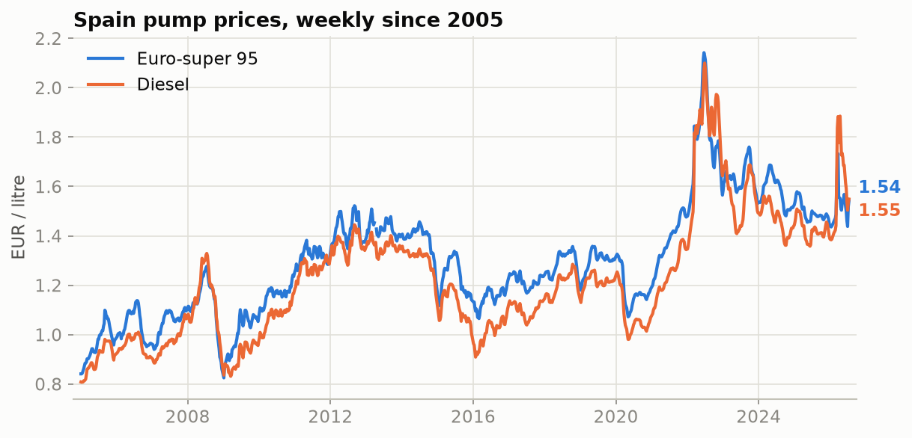
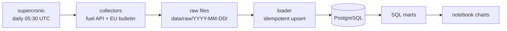
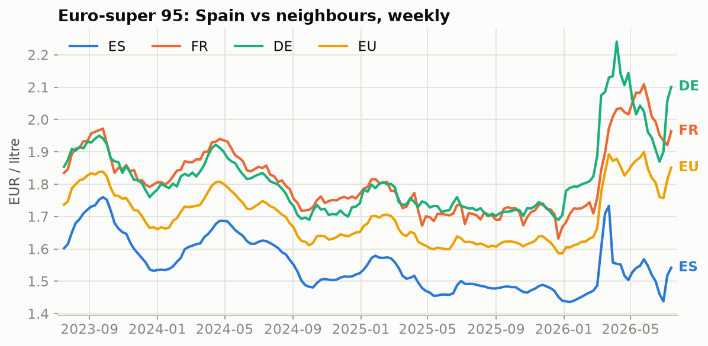
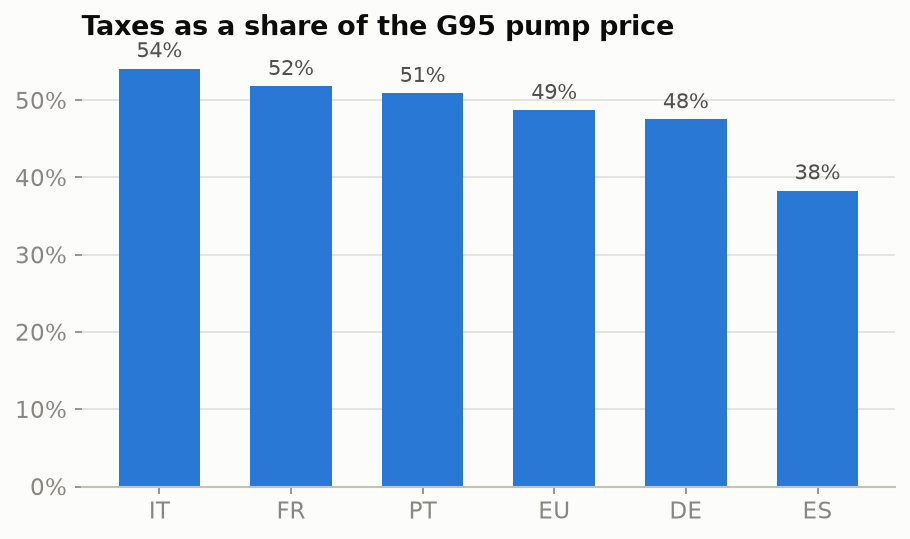
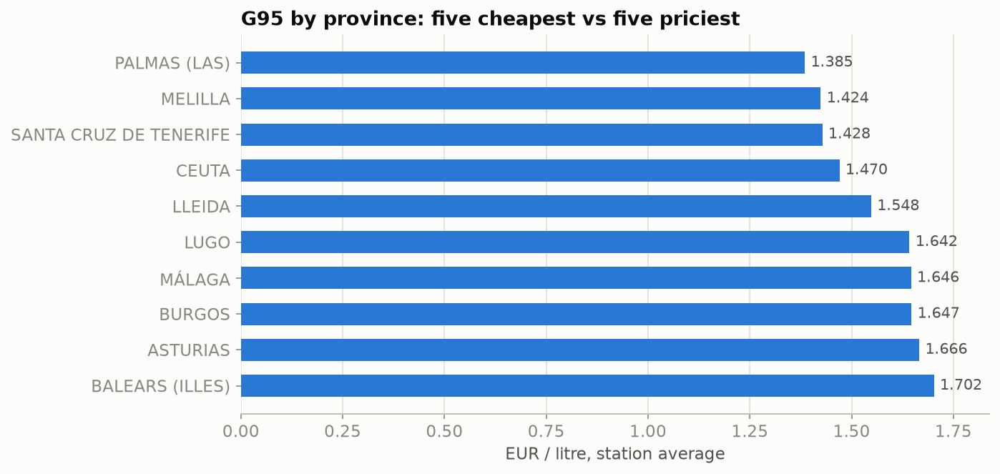

# Fuel Price Radar

[](https://github.com/isistomin/fuel-price-radar/actions/workflows/ci.yml)

[](LICENSE)

Spain & EU fuel price intelligence pipeline: daily prices from 11,500+ gas stations + EU-wide weekly benchmarks since 2005, PostgreSQL, automated ETL.



## Why

Fuel retail is a price-intelligence business: margins are thin, prices move weekly, and every chain watches its competitors. This project rebuilds that kind of monitoring pipeline on open data — collect competitor prices daily, keep the history, slice it by region and brand, benchmark against the market. The same shape of pipeline drives repricing and assortment decisions in e-commerce; here the "market" is every gas station in Spain plus the official EU price bulletins.

## Data sources

| Source | What | Cadence | Format |
|---|---|---|---|
| [Spanish Ministry fuel API](https://sedeaplicaciones.minetur.gob.es/ServiciosRESTCarburantes/PreciosCarburantes/EstacionesTerrestres/) | Prices for ~11,500 stations: brand, province, coordinates, G95/G98/diesel | Daily snapshot | JSON (prices as `"1,479"` strings — normalized on load) |
| [EU Weekly Oil Bulletin](https://energy.ec.europa.eu/data-and-analysis/weekly-oil-bulletin_en) | Weekly prices per EU country, with and without taxes, back to 2005 | Weekly | HTML page → consolidated XLSX (226 columns, variable-width country blocks) |

Roughly 27,000 station×fuel price points per day plus 60,000+ historical EU records from the backfill.

## Architecture



Design decisions worth calling out:

- **Raw first.** Collectors write API responses to disk byte-for-byte before anything parses them. The government API serves current prices only — if a parser bug slips through, the raw files survive and the database can be rebuilt from scratch. The DB is derived state.
- **Idempotent loads.** Everything lands via `INSERT … ON CONFLICT` keyed on natural unique constraints, so re-loading any raw file is a no-op, not a duplicate.
- **The database is never exposed.** Postgres listens on localhost only; the collectors run next to it on the same box under [supercronic](https://github.com/aptible/supercronic). No inbound ports, no DB credentials outside the server.
- **Every run is logged** to a `runs` table: source, duration, items ok/failed. Cheap observability that doubles as a health dashboard.

## Quick start

Requires Docker and [uv](https://docs.astral.sh/uv/).

```bash
git clone https://github.com/isistomin/fuel-price-radar.git
cd fuel-price-radar
uv sync
make demo   # postgres up → migrations → collect → load → marts → charts
```

`make demo` fetches live data from both sources (one polite request each), loads it, and renders the charts into `docs/img/` — a populated database in about two minutes.

Individual steps: `make up / migrate / collect / load / marts / report / test / lint`.

### Production mode

On a server the same compose file runs the scheduler too:

```bash
docker compose --profile server up -d --build
docker compose exec cron sh -c "cd /app && .venv/bin/alembic upgrade head"
```

The `cron` container fires `collect && load` daily at 05:30 UTC. Repeat the `alembic upgrade` after pulling a release that ships new migrations.

## Status page

`python -m pipeline site` renders a static status page into `site/` — pipeline health from the `runs` journal, latest Spanish pump prices, two charts. Plain HTML + PNG, no backend: the daily cron job rebuilds it right after the load, so the files are always current and can be served by anything. With Caddy in front, mounting it under a path is four lines:

```
your-domain.com {
    handle_path /fuel* {
        root * /path/to/fuel-price-radar/site
        file_server
    }
}
```

## Schema

```
sources          what we collect from (API / HTML)
products         one priced item: station × fuel, or country × fuel
                 UNIQUE (source_id, external_id), attrs as JSONB
price_snapshots  price per product per day/week, pre-tax price when known
                 UNIQUE (product_id, collected_at), numeric(10,3)
runs             collection/load journal: status, items ok/failed
```

Three SQL marts (views, `sql/marts/`, applied with `python -m pipeline marts`):

| Mart | Question it answers |
|---|---|
| `mart_price_history` | How prices move: Spain daily (station average) + every EU country weekly |
| `mart_regional_spread` | Where fuel is cheap, which chains price higher — by province and brand |
| `mart_spain_vs_eu` | Spain vs FR/PT/IT/DE and the EU mean, plus the tax share of every litre |

## What the data shows



Spain consistently undercuts its neighbours and the EU average on gasoline — and the tax cut explains most of it: taxes are ~38% of a Spanish litre vs ~52% in France.



Inside Spain the spread is wide. The Canary Islands and the autonomous cities run their own fuel tax regime and come out ~30 cents cheaper than the Balearics:



## Politeness & limitations

- Custom `User-Agent` with a link to this repo; `robots.txt` checked before scraping.
- One request per run to the fuel API; bulletin downloads are spaced ≥1.5 s; retries use exponential backoff and give up immediately on HTTP 429.
- Station prices are collected once a day (the API updates every 30 min — intraday moves are out of scope).
- Bulletin prices for non-euro countries are the EC's own EUR conversions.

## Roadmap

- Metabase for ad-hoc exploration
- Partitioning `price_snapshots` when the table earns it
- Pin and scan the Docker base image

## License

MIT
